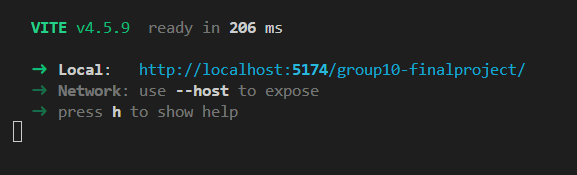

# Travel Advisor 🌍

Live Build: [https://travel-advisor-project.vercel.app/](https://travel-advisor-project.vercel.app/)

## Project Overview

Travel Advisor is a modern Vite + React application that helps users discover new travel destinations and receive personalized recommendations powered by AI. This guide provides step-by-step instructions for setting up the project locally and deploying it.

> **Note**: The Tripadvisor backend for this project is deployed using Express on Vercel. To view the source code for the backend, check out the [TripAdvisor Backend Repository](https://github.com/f4ncy1zach/cmpt276-group10-backend).

## 🎥 Video Presentation

Watch our full project presentation here:  
👉 [Video Presentation on Google Drive](https://drive.google.com/file/d/1XvrvX8FSCE4AEr4jEBwm7ABnHE8nOTMh/view?usp=sharing)

## 📄 Project Report 

Here is our Project's Final Report:  
👉 [Final Report](./misc/cmpt276-final-report.pdf)

## 🚀 Running a Local Deployment

Follow these instructions to deploy and run the application on your device.

### 1. Clone the Repository

To begin, clone the repository to your local machine.

- Open your terminal and navigate to the directory where you'd like to store the project.
  - You can use `cd` to change directories.

- Run the following commands:
  ```bash
  git clone https://github.com/f4ncy1zach/group10-finalproject.git
  cd group10-finalproject
  ```

### 2. Install the Required Dependencies

#### ⚠️ Pre-Requisite: Ensure Node.js is Installed
Before proceeding, make sure that [Node.js](https://nodejs.org/en) is installed on your machine.

- To check, run the following command:
  ```bash
  node --version
  ```

- If the command outputs a version number (e.g., `v14.x.x`), you’re good to go.

- If you don’t have Node.js installed, download and install the LTS version from [Node.js Official Website](https://nodejs.org/en).

- After installation, rerun the command to ensure it's installed correctly.

#### Install Dependencies

Once Node.js is set up, run the following command to install the project’s dependencies:
```bash
npm install
```

### 3. Setting Up Environment Variables

Before running the app, you need to set up environment variables.

- Create a `.env` file in the root directory of the project and add the following line:
  ```
  VITE_OPENAI_API_KEY=<your-openai-api-key>
  ```

> 🔐 **Note**: Replace `<your-openai-api-key>` with your actual OpenAI API key.

### 4. Running the Application

Now that everything is set up, you can run the application.

- Use the following command to start the development server:
  ``` 
  npm run dev
  ```

- Once the application is running, you should see an output similar to this:

  

- You can either click the link provided in the terminal or manually enter it in your preferred web browser.

---

## ❗Important Notes

- Ensure that all previous steps have been followed exactly. If you encounter any issues, verify each step carefully.
- This project utilizes **Vite** for fast build times and hot module replacement, which makes the development process faster.

---

## 🔗 Live Build

You can view the deployed version here:  
👉 [https://travel-advisor-project.vercel.app/](https://travel-advisor-project.vercel.app/)

---

Happy travels! ✈️🌎